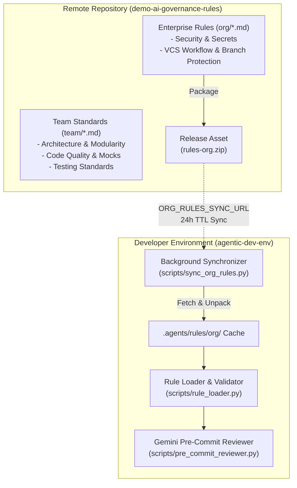

# AI Development Governance Rules (Remote)

[](https://github.com/buildwithdc/agentic-dev-env)
[](LICENSE)

A canonical enterprise governance rules repository designed to serve as a remote policy source for AI-assisted engineering environments.

This repository is the reference remote rule provider for [**buildwithdc/agentic-dev-env**](https://github.com/buildwithdc/agentic-dev-env), which provides the client-side enforcement engine, Gemini-powered pre-commit auditor, background synchronization worker, and developer workflow tooling.

---

## Overview

Modern AI-assisted coding tools require clear, structured boundary rules to ensure generated code conforms to enterprise security, quality, architecture, and VCS standards.

This repository establishes a centralized distribution point for:
- **Enterprise-Wide Policies (`org/`)**: Mandatory, non-negotiable guidelines (e.g., branch protection, zero hardcoded secrets) automatically synced to downstream developer environments.
- **Team Guidelines (`team/`)**: Modular, domain-specific standards (e.g., architecture boundaries, typing, isolated test standards) that teams can adopt or customize.
- **Packaged Rule Distribution (`rules-org.zip`)**: Ready-to-publish release assets consumed by automated background synchronizers.



---

## Companion Repository: `agentic-dev-env`

The implementation engine that consumes and enforces these rules lives in:
👉 [**https://github.com/buildwithdc/agentic-dev-env**](https://github.com/buildwithdc/agentic-dev-env)

Key capabilities provided by `agentic-dev-env`:
- **Automated Rule Syncing**: Detached background synchronization (`scripts/sync_org_rules.py`) with 24-hour TTL caching, atomic updates, and offline fallback.
- **Gemini AI Pre-Commit Reviewer**: Evaluates staged git diffs against synced organizational rules and blocks commits violating critical policies.
- **Tiered Governance Hierarchy**: Multi-layered rule resolution (`org` > `team` > `personal` > `project`) with priority-based precedence.
- **Audit Logging**: Structured log trail (`.agents/audit.log`) tracking policy checks, override justifications, and sync operations.

---

## Repository Structure

```text
.
├── org/                              # Canonical Enterprise Policies (Mandatory)
│   ├── org-01-meta-guidelines.md     # VCS branching, branch protection, conventional commits
│   └── org-02-security-and-secrets.md# Zero hardcoded secrets, dynamic loading, redaction
├── team/                             # Team-Level Engineering Standards (Recommended)
│   ├── team-01-architecture.md       # Layer isolation, boundaries, contract-first design
│   ├── team-02-code-quality.md       # Static typing, atomic changes, mock transparency
│   └── team-03-testing-standards.md  # Hermetic tests, fixture isolation, deterministic suites
├── rules-org.zip                     # Pre-packaged release archive for downstream sync
└── README.md
```

### Included Rules Catalog

| Rule ID | Scope | Severity | Summary |
| :--- | :--- | :--- | :--- |
| [`org-01-meta-guidelines`](org/org-01-meta-guidelines.md) | Org | `CRITICAL` | Strict `main` branch protection, conventional commits, and atomic git operations. |
| [`org-02-security-and-secrets`](org/org-02-security-and-secrets.md) | Org | `CRITICAL` | Zero plaintext credentials, dynamic secret injection, and diagnostic redaction. |
| [`team-01-architecture`](team/team-01-architecture.md) | Team | `WARN` | Layer separation, contract-first interfaces, and circular dependency prevention. |
| [`team-02-code-quality`](team/team-02-code-quality.md) | Team | `WARN` | Mandatory type annotations, mock transparency, and autonomous fix boundaries. |
| [`team-03-testing-standards`](team/team-03-testing-standards.md) | Team | `WARN` | Hermetic unit/integration tests, offline execution, and deterministic fixtures. |

---

## Rule Schema & Specifications

All rules are authored in Markdown with standardized YAML frontmatter parsed by the `agentic-dev-env` rule engine:

```markdown
---
id: org-01-meta-guidelines
title: VCS Workflow, Branch Protection & Commit Standards
severity_default: CRITICAL
applies_to:
  - "**/*"
tags:
  - git
  - workflow
  - branch-protection
---

# Rule Content
...
```

### Fields

- **`id`** *(string, required)*: Unique slug identifier for the rule (e.g., `org-01-meta-guidelines`).
- **`title`** *(string, required)*: Descriptive, human-readable name.
- **`severity_default`** *(string, required)*:
  - `CRITICAL`: Commits violating this rule are strictly blocked during pre-commit reviews.
  - `WARN`: Violations emit prominent warnings during evaluation.
  - `INFO`: Advisory guidance for developer consideration.
- **`applies_to`** *(list of glob patterns, required)*: Target paths where the rule applies (e.g., `["**/*"]`, `["**/*.py"]`).
- **`tags`** *(list of strings, optional)*: Categorization tags for filtering and indexing.

---

## Configuring Downstream Synchronization

To subscribe an [`agentic-dev-env`](https://github.com/buildwithdc/agentic-dev-env) installation to this remote rule repository:

### 1. Set the Remote Sync URL in `.env`

Add `ORG_RULES_SYNC_URL` to your downstream project's `.env` file using any of the following supported formats:

```bash
# Option A: Direct release asset download (Recommended)
ORG_RULES_SYNC_URL="https://github.com/buildwithdc/demo-ai-governance-rules/releases/latest/download/rules-org.zip"

# Option B: Specific tagged release
ORG_RULES_SYNC_URL="https://github.com/buildwithdc/demo-ai-governance-rules/releases/tag/v1.0.0"

# Option C: Repository main branch archive
ORG_RULES_SYNC_URL="https://github.com/buildwithdc/demo-ai-governance-rules"
```

### 2. Trigger Synchronization

In your downstream `agentic-dev-env` workspace:

```bash
# Explicitly force-sync rules
python scripts/sync_org_rules.py --force

# Verify synced rules in local cache
ls -la .agents/rules/org/
```

Downstream pre-commit checks will automatically verify cache freshness and trigger detached background updates when the local copy exceeds 24 hours.

---

## Packaging & Publishing Releases

To package and publish rule updates to GitHub:

```bash
# 1. Update the distribution zip bundle
zip -j rules-org.zip org/*.md

# 2. Commit and push updates via a PR branch
git checkout -b chore/update-canonical-rules
git add org/ rules-org.zip
git commit -m "chore(rules): update canonical enterprise policies"
git push origin chore/update-canonical-rules

# 3. Tag and publish a new GitHub release
gh release create v1.0.0 rules-org.zip \
  --title "v1.0.0 Enterprise Governance Rules" \
  --notes "Canonical organizational baseline policies for agentic development."
```

---

## Related Repositories

- [**buildwithdc/agentic-dev-env**](https://github.com/buildwithdc/agentic-dev-env): Complete implementation of the agentic development environment, pre-commit reviewer, and governance sync runner.
